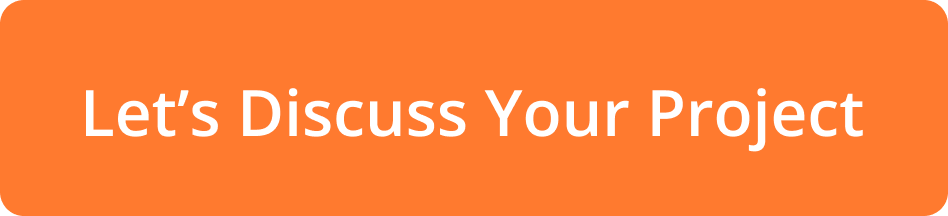

 
 

    
  
 
     
     

    <h3>
        Turn your awesome idea into a world-class mobile app with top software development company in the USA, India & across the globe. Expand your business opportunities with our scalable and seamless IT services to speed up your growth.
    </h3>
    

    
    
    

 
 

    <h2>Our Expertise in Different Technologies</h2>

<table>
<tr>
    <td>Flutter</td>
    <td>&nbsp; &nbsp;  PHP  </td>
    <td>&nbsp; &nbsp;  Dot Net</td>
    <td>&nbsp; &nbsp;  NodeJS</td>
</tr>

<tr>
    <td>&nbsp; &nbsp; iOS</td>
    <td>&nbsp; &nbsp;Laravel</td>
    <td>&nbsp; &nbsp;eCommerce</td>
    <td>&nbsp; &nbsp;Angular</td>
</tr>

<tr>
    <td>&nbsp; &nbsp;Android</td>
    <td>&nbsp; &nbsp;SaaS</td>
    <td>&nbsp; &nbsp;Wordpress</td>
    <td>&nbsp; &nbsp;AI/ML</td>
</tr>

<tr>
    <td>&nbsp; &nbsp;React Native</td>
    <td>&nbsp; &nbsp;PWA</td>
    <td>&nbsp; &nbsp;AR/VR</td>
    <td>&nbsp; &nbsp;MAC</td>
</tr>

<tr>
    <td>&nbsp; &nbsp;Python</td>
    <td>&nbsp; &nbsp;CI</td>
    <td>&nbsp; &nbsp;Blockchain</td>
    <td>&nbsp; &nbsp;Windows</td>
</tr>

<tr>
    <td>&nbsp; &nbsp;WebRTC</td>
    <td>&nbsp; &nbsp;Wearable</td>
    <td>&nbsp; &nbsp;Asterisk</td>
    <td>&nbsp; &nbsp;IoT</td>
</tr>

<tr>
    <td>&nbsp; &nbsp;Metaverse</td>
    <td></td>
    <td></td>
    <td></td>
</tr>

</table>
 

